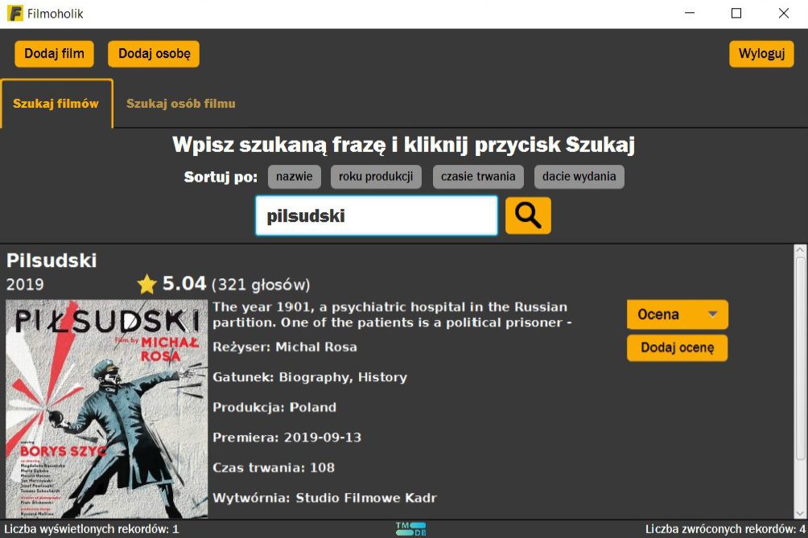

# Databases_1_Project
Semester project for **Databases 1** course concerning usage of **SQL** language in *PostgreSQL* RDBMS with *ElephantSQL* cloud.

## Filmoholik uses **The movieDB** as an *API* for movie posters and portraits of people connected to movie industry.
The relations in the database are based on data that is shared by the Internet Movie Database (IMDB).
The **Filmoholik** project includes implementations of: 
* queries
* views
* triggers and trigger functions
* aggregate functions

## ERD diagram 
![diagram] (diagram_ERD.png)

## Application usage example

